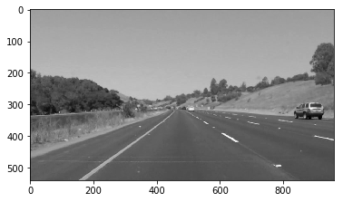
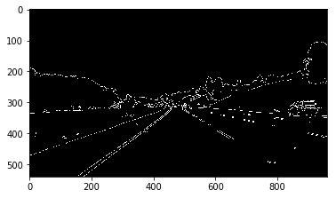
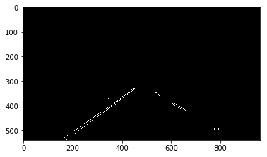
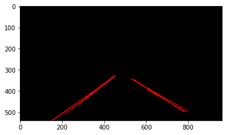
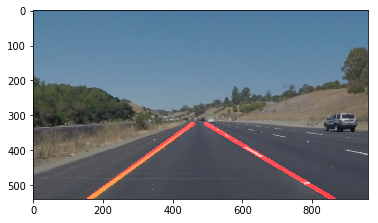

**Finding Lane Lines on the Road**

Computer vision algorithm for finding lanes in road images for CarND finding lane lines project

# Pipeline:

My pipeline consisted of 5 steps.
1. convert the rgb colored image to grayscale to blend every channel and get it ready for single line edge detection algorithm.

2. elimnating noise in image the caused by analog photo sensor and ambient noise by filtering using gaussian blur filter.

3. Apply canny edge detector on the resulted grayscale image to extract the features(edges).

4. Apply region of interest cutting step to cut out the unnecessary regions of edge image to prevent them from entering the line detection 
algorithm (can cause false results).

5. Apply hough transform to detect the lines of the cutted edges image to get line segments of that image.

6. defrag the lines by slope direction to split them into right lane lines and left lane lines.

7. fit each line and extract their coefficients then calculate the mean of thier coefficients.

8. define y plot space and use the resulted coefficients to draw right lane and left lane line.

9. blend the two resulted images with each other

### 2. Potential shortcomings could happen with this pipeline

One potential shortcoming would be happen when there is any strait object (could be car) entered the region of interest could noise the line defragment process and cause bad results

another shortcoming would be happen when one of the lanes is out of the region of interest!!!

### 3. Future improvments

A possible improvement would be to mean the right and left coefficients by time.

